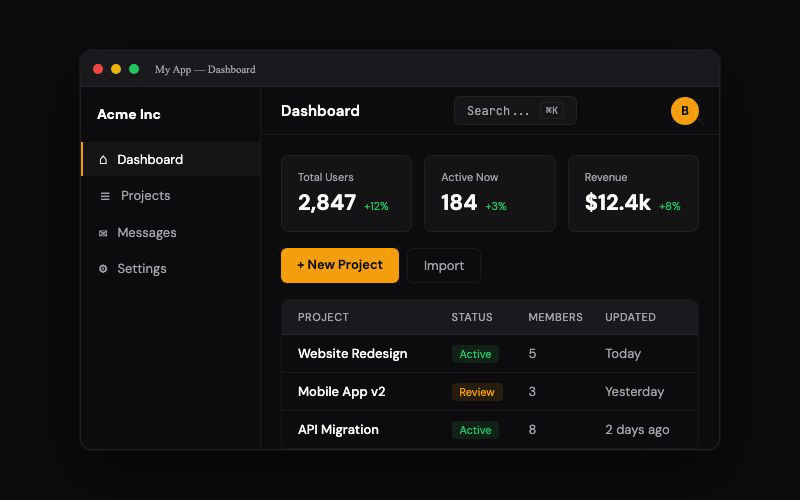

<p align="center">
  
</p>

<h1 align="center">react-spotlight</h1>

<p align="center">
  Beautiful onboarding tours & feature highlights for React.<br/>
  Zero dependencies. Looks like 2026, not 2018.
</p>

<p align="center">
  <a href="https://www.npmjs.com/package/react-spotlight"></a>
  <a href="https://bundlephobia.com/package/react-spotlight"></a>
  <a href="https://github.com/bilaltahir/react-spotlight/blob/main/LICENSE"></a>
  <a href="https://github.com/bilaltahir/react-spotlight/actions/workflows/ci.yml"></a>
  <a href="https://www.npmjs.com/package/react-spotlight"></a>
</p>

---

## The Problem

<p align="center">
  
</p>

React Joyride — the most popular tour library — is **broken on React 19**. It uses deprecated APIs (`unmountComponentAtNode`, `unstable_renderSubtreeIntoContainer`) and hasn't been updated in 9+ months. Shepherd.js requires a paid commercial license. Intro.js is GPL. Driver.js has no React bindings. Every developer evaluating tour libraries in 2025–2026 hit the same wall: **nothing modern, free, and React-native exists.**

react-spotlight fills that gap.

## Install

```bash
npm install react-spotlight @floating-ui/react-dom
```

## Quickstart

```tsx
import { SpotlightProvider, SpotlightTour, useSpotlight } from 'react-spotlight'
import 'react-spotlight/styles.css'

function App() {
  return (
    <SpotlightProvider>
      <SpotlightTour
        id="onboarding"
        steps={[
          {
            target: '#search-input',
            title: 'Search',
            content: 'Find anything instantly with our search.',
            placement: 'bottom',
          },
          {
            target: '[data-tour="sidebar"]',
            title: 'Navigation',
            content: 'Browse your projects and teams here.',
            placement: 'right',
          },
          {
            target: '#create-button',
            title: 'Create',
            content: 'Start a new project in one click.',
            placement: 'bottom',
          },
        ]}
        onComplete={() => console.log('Tour complete!')}
      />
      <Dashboard />
    </SpotlightProvider>
  )
}

function Dashboard() {
  const { start } = useSpotlight()
  return <button onClick={() => start('onboarding')}>Start Tour</button>
}
```

## Why react-spotlight

|  | What you get |
|---|---|
| 🎨 **Beautiful by default** | Modern, polished tooltips with smooth CSS clip-path spotlight transitions. Light, dark, and custom themes out of the box. |
| ♿ **Accessible** | WCAG 2.1 AA compliant. Focus trap, keyboard navigation, ARIA roles, screen reader announcements. |
| ⚡ **Tiny** | ~5KB gzipped core (vs ~30KB for Joyride). Floating UI is an optional peer dependency. |
| 🆓 **MIT License** | Free for commercial use. No GPL restrictions, no paid tiers. |

## Features

- 🔦 **CSS clip-path spotlight** — GPU-accelerated, never breaks in dark mode (no `mix-blend-mode` hacks)
- 🎯 **Floating UI positioning** — smart flip, shift, and overflow handling
- ⌨️ **Full keyboard navigation** — Arrow keys, Escape, Tab focus trap
- 🔄 **Async element waiting** — `MutationObserver`-based, handles lazy-loaded content
- 🎨 **Light / Dark / Custom themes** — auto-detect OS preference or bring your own
- 📱 **Responsive & mobile-friendly** — works on any screen size
- 🧪 **React 19 compatible** — built for modern React, no deprecated APIs
- 🌍 **i18n support** — customize all button labels and step text
- 🎯 **Single-element highlights** — one-off "What's new" callouts without a full tour
- 🔌 **Custom tooltips** — full render prop API for complete control

## Themes

<p align="center">
  
</p>

```tsx
// Auto-detect OS preference
<SpotlightProvider theme="auto">

// Explicit theme
<SpotlightProvider theme="dark">

// Custom theme
<SpotlightProvider theme={{
  tooltip: { background: '#1a1a2e', color: '#f0f0f8', ... },
  button: { background: '#6366f1', ... },
  ...
}}>
```

## Dark Mode

<p align="center">
  
</p>

react-spotlight uses CSS `clip-path` instead of `mix-blend-mode`. This means the spotlight overlay works **perfectly** regardless of background color, dark mode, CSS filters, or `isolation` contexts — all scenarios where Joyride's overlay breaks.

## Accessibility

<p align="center">
  
</p>

- `role="dialog"` with `aria-labelledby` and `aria-describedby`
- Focus trap inside tooltip (Tab cycles through buttons only)
- Escape key dismisses the tour
- Arrow keys navigate between steps
- `aria-live="polite"` announces step changes to screen readers
- `inert` attribute applied to background content
- All buttons are semantic `<button>` elements
- Respects `prefers-reduced-motion`

## Comparison

| Feature | react-spotlight | React Joyride | Shepherd.js | Driver.js | Intro.js |
|---|---|---|---|---|---|
| **React 19** | ✅ | ❌ Broken | ❌ Wrapper | ⚠️ No React | ⚠️ No React |
| **License** | MIT | MIT | Paid commercial | MIT | GPL / Paid |
| **Bundle size** | ~5KB | ~30KB | ~25KB | ~5KB | ~12KB |
| **React-native** | ✅ React-first | ✅ | ❌ Vanilla JS | ❌ Vanilla JS | ❌ Vanilla JS |
| **Dark mode** | ✅ clip-path | ❌ mix-blend breaks | ✅ SVG | ✅ | ⚠️ |
| **Accessibility** | ✅ WCAG 2.1 AA | ⚠️ Limited | ⚠️ Limited | ⚠️ Limited | ❌ Poor |
| **Custom tooltips** | ✅ Render props | ✅ Components | ⚠️ HTML strings | ⚠️ HTML strings | ⚠️ HTML strings |
| **Async elements** | ✅ MutationObserver | ❌ setTimeout | ⚠️ Promise | ❌ | ❌ |
| **Focus trap** | ✅ | ❌ | ❌ | ❌ | ❌ |
| **Keyboard nav** | ✅ Full | ⚠️ Basic | ⚠️ Basic | ⚠️ Esc only | ⚠️ Basic |
| **Zero deps** | ✅ | ❌ | ❌ | ✅ | ❌ |

## API

### `<SpotlightProvider>`

Wraps your app and provides tour context.

```tsx
<SpotlightProvider
  theme="auto"                          // 'light' | 'dark' | 'auto' | custom theme object
  overlayColor="rgba(0, 0, 0, 0.5)"    // overlay background
  transitionDuration={300}              // animation duration in ms
  escToDismiss={true}                   // Escape key dismisses
  overlayClickToDismiss={true}          // clicking overlay dismisses
  showProgress={true}                   // show progress bar
  showSkip={true}                       // show skip button
  labels={{ next: 'Next', previous: 'Back', skip: 'Skip', done: 'Done' }}
  onComplete={(tourId) => {}}           // any tour completes
  onSkip={(tourId, stepIndex) => {}}    // any tour skipped
>
  {children}
</SpotlightProvider>
```

### `<SpotlightTour>`

Registers a tour. Doesn't render anything — just makes steps available to start.

```tsx
<SpotlightTour
  id="onboarding"
  steps={[
    { target: '#search', title: 'Search', content: 'Find anything.', placement: 'bottom' },
    { target: '#nav', title: 'Navigation', content: 'Browse projects.', placement: 'right' },
  ]}
  onComplete={() => markDone()}
  onSkip={(stepIndex) => track(stepIndex)}
/>
```

### `useSpotlight()`

Read and control tour state.

```tsx
const { start, stop, next, previous, skip, isActive, currentStep, totalSteps } = useSpotlight()
```

### `useSpotlightControl()`

Imperative control for programmatic highlights.

```tsx
const spotlight = useSpotlightControl()

spotlight.highlight({
  target: '#new-feature',
  title: 'New: Dark Mode',
  content: 'We just shipped dark mode. Try it out!',
  placement: 'bottom',
})
```

### `<SpotlightHighlight>`

Declarative single-element highlight.

```tsx
<SpotlightHighlight
  target="#new-feature"
  title="New: Dark Mode"
  content="We just shipped dark mode!"
  active={showHighlight}
  onDismiss={() => setShowHighlight(false)}
/>
```

### Custom Tooltip

Full control over tooltip rendering via render props:

```tsx
<SpotlightTour
  id="custom"
  steps={steps}
  renderTooltip={({ step, next, previous, skip, currentIndex, totalSteps }) => (
    <div className="my-tooltip">
      <h3>{step.title}</h3>
      <p>{step.content}</p>
      <div>
        <button onClick={previous} disabled={currentIndex === 0}>Back</button>
        <span>{currentIndex + 1} / {totalSteps}</span>
        {currentIndex < totalSteps - 1
          ? <button onClick={next}>Next</button>
          : <button onClick={next}>Done</button>}
      </div>
    </div>
  )}
/>
```

### Step Configuration

```typescript
interface SpotlightStep {
  target: string | React.RefObject<HTMLElement>  // CSS selector or ref
  title: string
  content: React.ReactNode
  placement?: 'top' | 'bottom' | 'left' | 'right' | 'auto'
  spotlightPadding?: number     // padding around cutout (px)
  spotlightRadius?: number      // border radius of cutout (px)
  action?: { label: string; onClick: () => void }  // CTA button
  when?: () => boolean | Promise<boolean>           // conditional display
  onBeforeShow?: () => void | Promise<void>
  onAfterShow?: () => void
  onHide?: () => void
  disableOverlayClose?: boolean
  interactive?: boolean         // allow clicking the target element
}
```

## Full Documentation

Visit [react-spotlight.dev](https://react-spotlight.dev) for complete docs, interactive examples, and recipes for Next.js, Remix, shadcn/ui, and more.

## License

[MIT](LICENSE)
